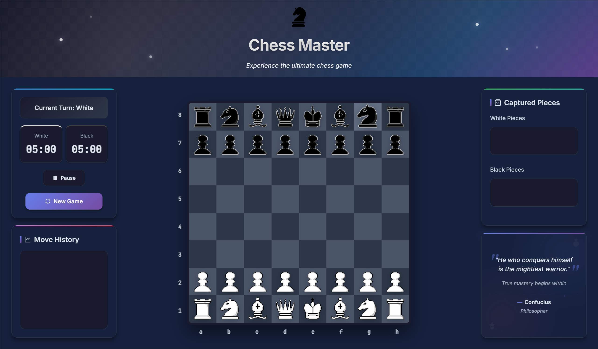

# Chess Master

A full-featured chess game implementation with a Spring Boot backend, supporting all standard chess rules and features. This project serves as a foundation for a scalable chess platform with future plans for online multiplayer capabilities.



## 🎮 Features

- **Complete Chess Rules Implementation**:
  - Standard piece movements and captures
  - Special moves (castling, en passant)
  - Check and checkmate detection
  - Stalemate recognition
  - Pawn promotion
  - Draw conditions (perpetual check, insufficient material)
  
- **Game Controls**:
  - Time control options
  - Game state persistence
  - Move history tracking

- **RESTful API**:
  - Game creation endpoints
  - Move validation and execution
  - Game state queries
  - Board representation

## 🏗️ Architecture

The project is structured following a clean, modular design:

### Core Components
- **Pieces**: Abstract base class with specific implementations (Pawn, Rook, Knight, etc.)
- **Board**: Manages the game state and piece positions
- **Game**: Coordinates game flow, rules enforcement, and state transitions
- **Timer**: Handles chess clock functionality for timed games

### Service Layer
Provides business logic to the controllers and handles game state management.

### API Layer
RESTful controllers exposing endpoints for game interaction.

### Frontend
Basic web interface for game visualization.

## 🚀 Future Plans

- Online multiplayer capability
- User accounts and authentication
- Game history and statistics
- Rating system
- Tournament support

## 💻 Technical Stack

- **Backend**: Java 21, Spring Boot 3.4.2
- **Build Tool**: Maven
- **Testing**: JUnit, with more than 60 comprehensive test cases
- **Frontend**: HTML, CSS and JavaScript

## 🧪 Testing

The project includes 69 test cases covering various aspects of the chess implementation:
- Piece movement validation
- Special move rules (en passant, castling)
- Check and checkmate scenarios
- Draw conditions
- Game state transitions

## 🔧 Development Journey

This project represents a significant milestone in my development journey. Starting from scratch with the core chess components (pieces, board), I built the entire system layer by layer:

1. Implemented the abstract `Piece` class and its concrete implementations
2. Developed the `Board` representation and state management
3. Created the `Game` logic to enforce rules and manage state
4. Added special chess rules like en passant (particularly challenging)
5. Built the service and controller layers
6. Implemented comprehensive testing (69 tests)
7. Added time control features

## 📝 Project Structure

```
src/
  ├── main/
  │   ├── java/
  │   │   └── itawi/
  │   │       └── chessgame/
  │   │           ├── ChessGameApplication.java
  │   │           ├── config/
  │   │           ├── controller/
  │   │           │   └── ChessGameController.java
  │   │           ├── core/
  │   │           │   ├── board/
  │   │           │   ├── enums/
  │   │           │   ├── game/
  │   │           │   ├── piece/
  │   │           │   ├── timer/
  │   │           │   └── util/
  │   │           ├── dto/
  │   │           └── service/
  │   │               └── ChessGameService.java
  │   └── resources/
  │       ├── static/
  │       │   └── js/
  │       │       └── chess.js
  │       └── templates/
  └── test/
      └── java/
          └── itawi/
              └── chessgame/
                  ├── ChessGameApplicationTests.java
                  └── core/
                      ├── board/
                      ├── game/
                      ├── piece/
                      └── timer/
```

## 🚀 Getting Started

### Prerequisites
- Java 21
- Maven

### Running the Application
1. Clone the repository
2. Run `mvn clean install`
3. Start the application with `mvn spring-boot:run`
4. Access the game at `http://localhost:8080`

## 📋 API Endpoints

- `POST /api/v1/chess/new-game` - Start a new game
- `GET /api/v1/chess/board` - Get the current board state
- `GET /api/v1/chess/status` - Get the current game status
- Additional endpoints for moves, promotions, and game state management

## 🔮 Challenges and Learnings

The most significant challenge during development was implementing the en passant rule correctly, which required careful consideration of piece state tracking and move validation. This project provided valuable experience in:

- Object-oriented design for complex rule systems
- State management in game applications
- Comprehensive test case development
- RESTful API design for interactive applications

---

Made with ♟️ and ❤️ by Itawi
